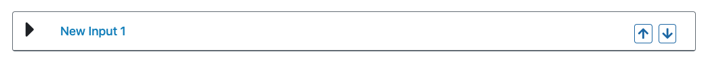
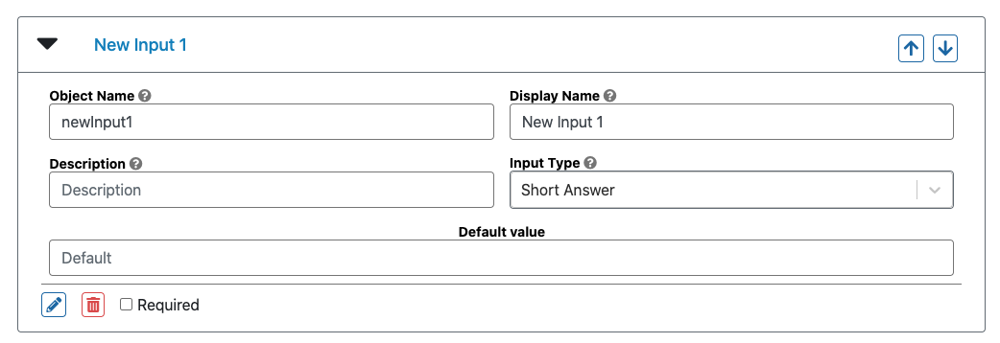
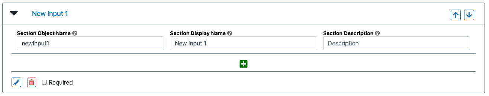
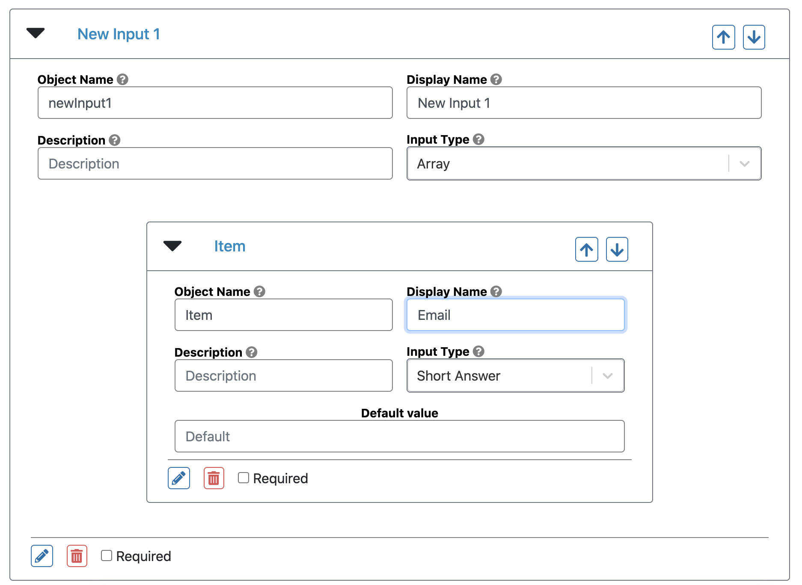
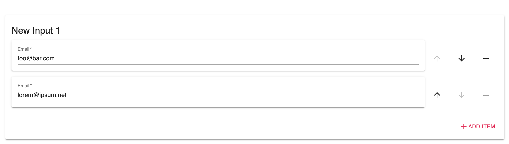
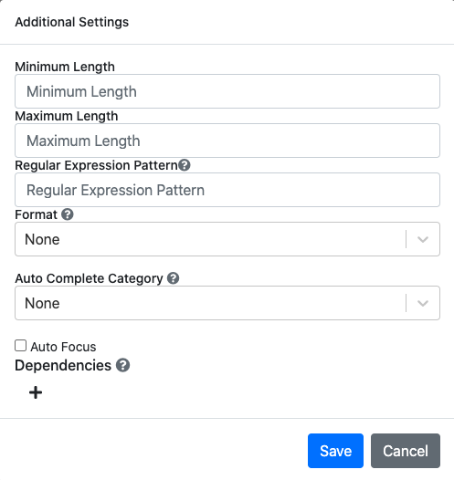
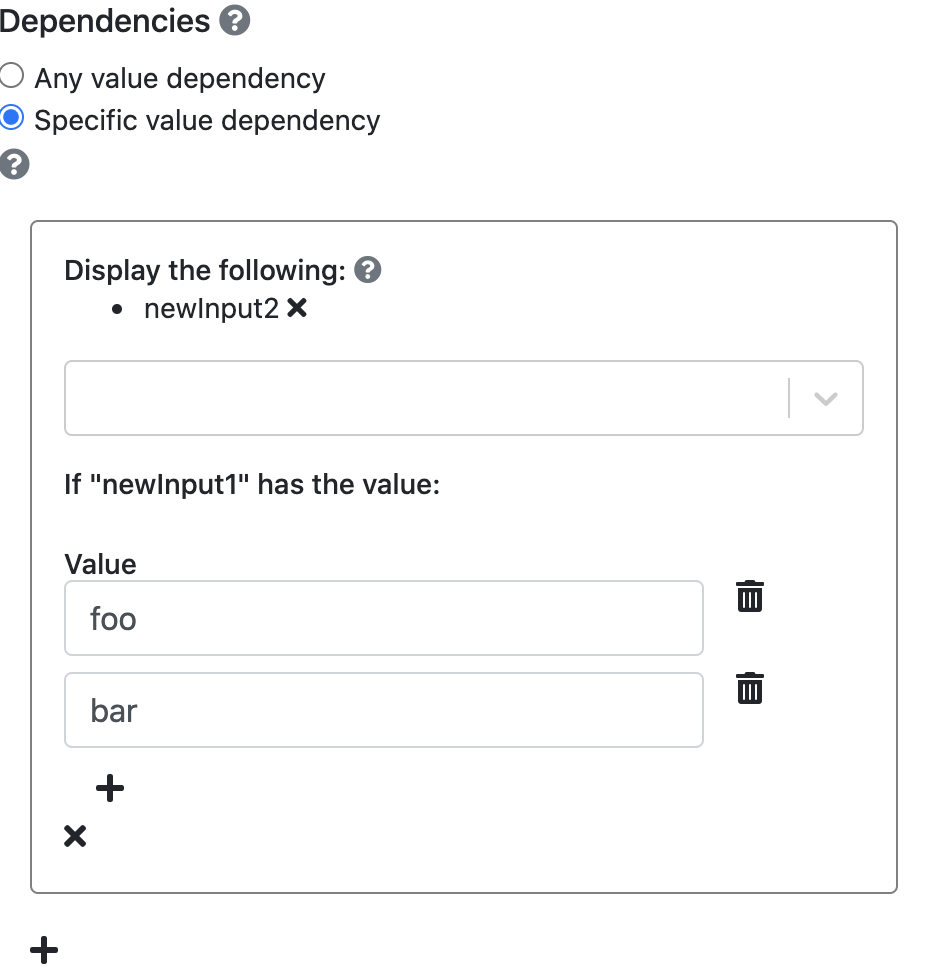
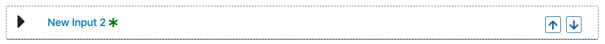
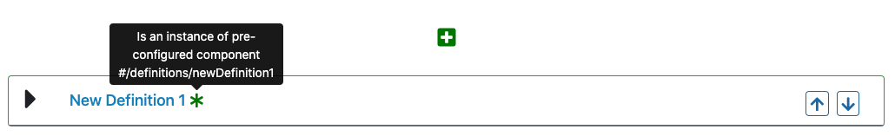

# Background

The Form Builder builds a JSON schema for use with the [JSON Schema Form component](https://react-jsonschema-form.readthedocs.io/en/latest/). It abstracts away the manual coding element for a flexible visual form building experience.

One of the key abstractions is rendering form elements by parsing the `properties`, `definitions`, and `dependencies` sections of standard JSON Schema form code into discrete elements that can be rearranged and edited in a manner similar to other standard form building solutions.

*(The above is adapted from [an original company blog post](https://www.ginkgobioworks.com/2020/10/08/building-a-no-code-json-schema-form-builder/))*

## Form Elements

The Form Builder abstracts away the code involved in JSON schema defined forms into discrete form elements. These show up as collapsible cards on the Form Builder itself, such as the following:

These can be added by clicking on the green "+" button beneath each form element, and they can be deleted by clicking on the "trash" icon within the expanded elements.

Every element has an Object Name, Display name, Description, and Input Type. The **Object Name** is what the data that gets entered into this form element will be stored under in the output. The **Display Name** is what the form element will actually be displayed as to the user filling out the form. If no Display Name is provided, the Object Name will be used as a default. The **Description** will show up as a smaller body of text below either the Object Name or the Display Name. The **Input Type** refers to the type of input that gets requested from the user by this form element. It could be a *Short Answer*, *Long Answer*, *Number*, etc.

Form elements can be marked as **required** if the corresponding checkbox is marked in the footer. This will require the user to enter some value to successfully submit the form (otherwise, the input will be highlighted).

### Input Types

The following is a list of currently supported default Input Types:

| Input Type   | Description                                                  |
| ------------ | ------------------------------------------------------------ |
| Time         | Request a string corresponding to a date time in the following format: "2020-12-00T12:00:00.000Z" |
| Checkbox     | Renders a checkbox, returns "True" or "False"                |
| Radio        | Present a multiple choice option for the user, with choices defined in the Form Element |
| Dropdown     | Present a dropdown option for the user, with choices defined in the Form Element |
| Short Answer | Asks for a simple string                                     |
| Password     | Asks for a simple string, renders a password input form that hides characters |
| Long Answer  | Asks for a long string in a textarea input                   |
| Integer      | Asks for an integer input, in an input that only allows integers |
| Number       | Asks for an float input, in an input that only allows floats |
| Array\*       | Allows a user to specify any number of items, with the items themselves a form element defined in the array |

\* See section on Array

In addition to these input types, the Form Builder can be customized to accept and create custom input types. To see an example, see the [usage doc](Usage.md) example.

### Cards

Cards are rendered as the generally smaller form elements, and represent a single form element. Their order in the Form Builder corresponds to their order in the form, and, unless the card is an array, contains no other form elements within it. Cards can be moved around by dragging and dropping them, or they can be rearranged with the arrow buttons in their header.

### Sections

Sections are rendered as larger cards, that themselves hold cards within them. To create a section, after hitting the "+" button, the builder selects "Form section" instead of "Form element." Sections do not have any input type of their own, but can contain Cards that have their own Input Types. Like Cards, Sections can be dragged around, moving their contents along with them.

To create a form element within a section, the builder must click on the "+" button *within* the section.

### Arrays

Arrays are a type of form element that contains a single form element or section within it. This represents the form element or section that the user can enter any number of times.

For example, the following is an Array that takes any number of email addresses:

And this is how it appears facing the user:

## Modals

Additional details about a form element can be defined in *modals* that appear when a user clicks on the "pencil" icon in the footer of a form element or section. These modals contain additional options that can set additioal requirements or features for a particular element. For example, this modal presents options for *Short Answer* Input types:

Here, the builder can mandate that the inputs adhere to a certain length requirement, fit a regular expression pattern, and provide an auto complete category. The options vary between input types, and the user can set their own modal options when they pass in custom input types.

## Dependencies

Form elements can be set to control the appearance of other form elements. The controlling element is referred to as the **parent** and the dependent form elements are referred to as **dependents**. Any element can be either a parent or a dependent.

To set a parent, a builder can open the modal for an element and click the small "+" button to create a **possibility**. When at least one possibility exists, the builder can also specify whether the possibilities should be triggered based on whether the parent has "Any value" (default) or whether it has a "Specific value." In the latter case, multiple **possibilities** can exist to account for different scenarios. For exampe, a certain set of dependents may be rendered when the parent has a particular value, but another set when the parent has another set of values.

This UI is ultimately an abstraction of the [React JSON Schema Form](https://react-jsonschema-form.readthedocs.io/en/latest/usage/dependencies/) dependencies feature, and does not fully capture the wide range of possibilities involving cascading logic that can be achieved through manual coding.

When a form element is dependent on another form element, it will appear with dashed borders and an asterisk indicating that it will remain hidden unless some condition in the parent element is satisfied.

## Definitions and References

The Form Builder also supports the **definitions** property in JSON Schema Form and the resulting **$ref** tags pointing to those definitions. By default, if there are no definitiosn detected in the underlying schema, the option to choose an input type as a reference will be disabled. However, if there is at least one defined definition, then a new option in the *Input Types* dropdown will appear, allowing the Form Builder to select a form input to have a reference to an existing definition. Any changes to that definition will propagate to all form elements that have a reference to it.

Since [this pull request](https://github.com/rjsf-team/react-jsonschema-form/pull/179), the `react-jsonschema-form` package has supported local overrides to `$ref` titles and descriptions. The Form Builder also supports this.

In the [usage doc](Usage.md), there is an optional additional component called the **PredefinedGallery** that allows a builder to also visually build the definitions.
