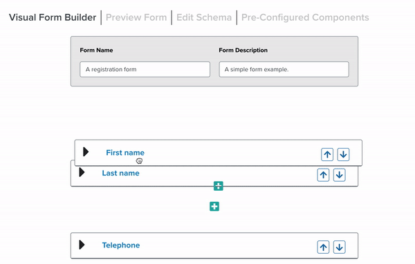

# React JSON Schema Form Editor



The React JSON Schema Form Builder is a ReactJS Component Library that allows the user to visually configure a [JSON Schema encoded form](https://json-schema.org/) by dragging, dropping, and editing card elements. An example use case for this tool could be for building an app that allows users to create and distribute their own surveys. The React JSON Schema Form Builder provides components to allow users to dynamically build such survey forms. The Form Builder is also customizable, and can incorporate novel form elements (like a special email address or file upload input), specified by the developer building the survey creation app.

This `FormBuilder` component is wrapped around a demo app that demonstrates how the tool can be used in conjunction with a code editor and [Mozilla's React JSON schema form viewer](https://github.com/rjsf-team/react-jsonschema-form) to build a form and maintain a live, code representation of it in real time.

The Form Builder is available as an NPM package [here](https://www.npmjs.com/package/@ginkgo-bioworks/react-json-schema-form-builder).

View the Form Builder in action [here](https://ginkgobioworks.github.io/react-json-schema-form-builder/)

## Quickstart

```bash
npm i --save @ginkgo-bioworks/react-json-schema-form-builder
```

Import the tool as a react component in your Node project:

## Usage

```javascript
import React, { Component } from 'react';
 
import {FormBuilder} from '@ginkgo-bioworks/react-json-schema-form-builder';
 
class Example extends Component {
  constructor(props) {
    super(props);
    this.state = {
      schema: '',
      uischema: ''
    };
  }
  render() {
    return (
      <FormBuilder
        schema={this.state.schema}
        uischema={this.state.uischema}
        onChange={(newSchema: string, newUiSchema: string) => {
          this.setState({
            schema: newSchema,
            uischema: newUiSchema
          })
        }}
      />
    );
  }
}
```

For more usage examples, see the [Usage documentation page](Usage.md)

## Credits

The Form Builder was built and is maintained by [Ginkgo Bioworks](https://www.ginkgobioworks.com/), and is open sourced through the Apache 2.0 license.

